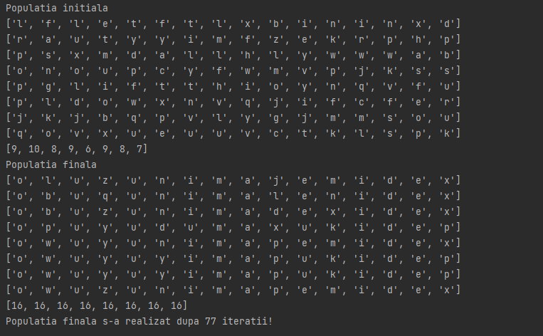

# StringGeneticAlgorithm

Genetic algorithm using Python. It generates a few random strings and then it tries to evolve them to strings that have vowels on the even positions and consonants on the odd positions.
